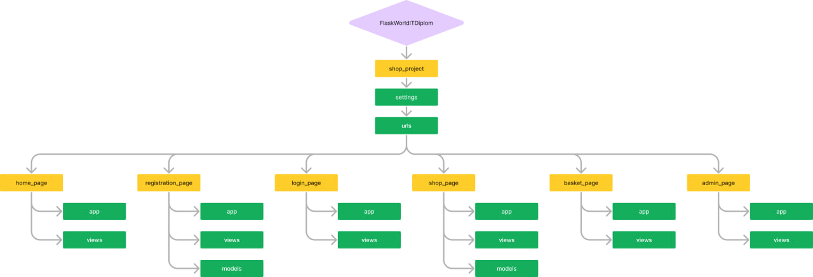

# Проект "Flask_WorldIT_Diplom"

## Перелік учасників

- [Московський Артемій](https://github.com/artemijMoskowsky)
- [Науменко Нікіта](https://github.com/Naumenko0Nikita)
- [Олефіренко Глеб](https://github.com/GlebOlefirenko)
- [Мартиненко Святослав](https://github.com/SviatMartynenko)

## Опис проекту:
Сайт-магазин написаний на мові програмування Python та JavaScript. Сайт надає можливість купувати товар, оформлювати замовлення, та за наявністю прав адміна додавати, редагувати та видаляти товар з магазину. Також сайт зв'язаний з телеграм ботом який надає адмінам можливість прийняти/відхилити ваше замовлення. При замовленні товару на почту користувача приходить повідомлення про здійснену покупку, та підтвердження замовлення.

## Чому проект корисний:
Цей проект дав нам змогу попрацювати з фреймворком Flask. При роботі над цим проектом ми познайомились зі структурою серверу, обробкою запитів, роботою з базами даних, роботою: з телеграм ботом, cookies, сесіями, gmail. Створення верстки, та розміщення проекту на pythonanywhere.
<br><br> Для оточуючих цей проект дає розуміння, як працюють усі вище перераховані технології.

## Початок роботи:
### Для роботи з нашим проектом вам знадобляться наступні модулі:
- alembic==1.13.1
- blinker==1.7.0
- certifi==2024.6.2
- charset-normalizer==3.3.2
- click==8.1.7
- colorama==0.4.6
- emoji==2.12.1
- Flask==3.0.3
- Flask-Login==0.6.3
- Flask-Mail==0.10.0
- Flask-Migrate==4.0.7
- Flask-SQLAlchemy==3.1.1
- greenlet==3.0.3
- idna==3.7
- itsdangerous==2.2.0
- Jinja2==3.1.3
- Mako==1.3.3
- MarkupSafe==2.1.5
- pyTelegramBotAPI==4.19.1
- requests==2.32.3
- SQLAlchemy==2.0.29
- telebot==0.0.5
- typing_extensions==4.11.0
- urllib3==2.2.1
- Werkzeug==3.0.2

### Як завантажити та запустити проект:
#### Завантажити проект:
1. Клонуйте репозиторій: `git clone https://github.com/artemijMoskowsky/Flask_pract.git
2. Перейдіть до дерикторії проекту: `cd Flask_pract`
3. Завантажте залежності: `pip install -r requirements.txt`

#### Запуск сайту:
1. Перейдіть до дерикторії головного додатку: `cd shop_project`
2. Ініціалізуйте базу даних: `flask --app settings db init`
3. Проведіть міграції бази даних: `flask --app settings db migrate`
4. Зробіть оновлення версії бази даних: `flask --app settings db upgrade`
5. Поверніться до попередньої дерикторії: `cd /..`
6. Запустити файл manage.py: `python manage.py`

#### Запуск бота:
1. Перейти до дерикторії бота: `cd Flask_pract/bot_app`
2. Запустити файл settings.py: `python settings.py`

## Структура проекту:


### Приклад створення головного додатку:
```python
import flask, flask_sqlalchemy, flask_migrate 
import os
# Створюємо константу абсолютного шляху до файлу
PATH = os.path.abspath(__file__+"/..")
# Створюємо зміну для головного додатку
project_shop = flask.Flask(
    # Вказуємо папку у якій знаходиться проект
    import_name = "shop_project",
    # Вказуємо шлях до папки зі статичними файлами 
    static_folder = "static/shop_project",
    # Вказуємо шлях для ініциалізації бази данних
    instance_path = PATH
)
# Робимо конфігурацію проєкту для роботи з базою данних "sqlite", вказуємо ім'я бази данних "data.db" і вказуємо те що вона локальна
project_shop.config["SQLALCHEMY_DATABASE_URI"] = "sqlite:///data.db"
# Створюємо об'єкт бази данних
data_base = flask_sqlalchemy.SQLAlchemy(app = project_shop)
# Створюємо об'єкт міграцій
migrate = flask_migrate.Migrate(app = project_shop, db = data_base)
```

### Приклад створення додатку:
```python
import flask
# Створення Flask додатку
home_app = flask.Blueprint(
    # Даэмо назву додатку
    name = "home",
    # Вказуэмо місцезнаходження додатку
    import_name = "home_page",
    # Вказуємо шлях до папки зі статичними файлами 
    static_folder = "static/home_page",
    # Вказуэмо шлях до папки з шаблонами
    template_folder = "templates"
)
```

## Views нашого проекту:

### Home_page:
```python
# Імпортуємо Flask
import flask
# Імпортуємо Flask_login
import flask_login
# Із моделей додатку (shop) імпортуємо модель продуктів
from shop_page.models import Product
# Створюємо функцію відображення  
def show_home():
    # Завдаємо початкове значення для флагу (is_admin) * ДЛЯ ПЕРЕВІРКИ ЧИ КОРИСТУВАТЧ МАЄ ПРАВА АДМІНІСТРАТОРА *
    is_admin = False
    
    try:
        # Завдаємо значення для флагу, від поточного користувача * ДЛЯ ПЕРЕВІРКИ ЧИ КОРИСТУВАТЧ МАЄ ПРАВА АДМІНІСТРАТОРА * 
        is_admin = flask_login.current_user.is_admin
        # Стврорюємо змінну у якій буде зберігатися ім'я поточного користувача * ДЛЯ ВІДООБРАЖЕННЯ ІМЕНІ КОРИСТУВАЧА *  
        user_name = flask_login.current_user.name
    except:
        # Обнуляємо змінну імені користуватча * ДЛЯ ТОГО ЩОБ ІМЕНА НЕ ПОВТОРЮВАЛИСЬ І НЕ БУЛО ПОМИЛКИ *
        user_name = ""
    # Створюємо список з id продуктів
    list_products_ids = []
    # перебираємо список продуктів
    for product in Product.query.all():
        # Добовляємо у список (list_products_ids) останнім значенням id продукту, яке ми отримали у базі даних 
        list_products_ids.append(product.id)    
    # Відображаємо сторінку передаючі усі необхідні данні
    return flask.render_template(template_name_or_list = "home.html", user_name = user_name, link = "home", is_admin = is_admin, list_products_ids = list_products_ids)
```

### Shop_page:
```python
# Імпортуємо Flask
import flask
# Імпортуємо Flask_login
import flask_login
# Імпортуємо клас з моделю нашого продукта
from .models import Product

# Створюємо функція для відображення продукта
def show_shop():    
    # Задаєтся початкове значення is_admin
    is_admin = False
    # Задаєтся початкове значення user_name
    user_name = ""
    try:
        # Перезаписує значення is_admin, спираючись на значення користувача     
        is_admin = flask_login.current_user.is_admin
        # Перезаписує значення user_name, спираючись на значення користувача  
        user_name = flask_login.current_user.name
    

    except:
        pass
    # Створюємо список для збереження (id) продуктів
    list_products_ids = []
    # Перебираємо список продуктів
    for product in Product.query.all():
        # Додаємо id продуктів в список
        list_products_ids.append(product.id)    
    # Відтворюємо сторінку магазину, передаючі усі необхідні параметри
    return flask.render_template(template_name_or_list = "shop.html", user_name=user_name, link="shop", products = Product.query.all(), is_admin = is_admin, list_products_ids = list_products_ids)
```

### Registration_page:
```python
import flask 
# З моделей імпортуємо модель користувача 
from .models import User
# З основної деректоріїї імпортуємо базу данних
from shop_project.settings import data_base
# Створюємо функцію візуалізаціїї додатку реєстрації (registration_page)
def show_regestration():
    # Задаємо початкове значення для перевірки * ДЛЯ ПРОПОЗИЦІЇ ПЕРЕЙТИ ДО АВТОРИЗАЦІЇ *
    confirmed = False
    # Робимо перевирку: якщо метод запросу строго дорівнює "POST"
    if flask.request.method == "POST":
        # Записуємо у змінну (name), те що було введено у (<input>) з ім'ям "name"
        name = flask.request.form["name"]
        # Записуємо у змінну (name), те що було введено у (<input>) з ім'ям "email"
        email = flask.request.form["email"]
        # Записуємо у змінну (name), те що було введено у (<input>) з ім'ям "password"
        password = flask.request.form["password"]
        # Записуємо у змінну (name), те що було введено у (<input>) з ім'ям "password_confirm"
        password_confirm = flask.request.form["password_confirm"]

        try:
            # Створюємо змінну (user) для отримання всіх данних з моделі (User) 
            users = User.query.all()
            # Задаємо початкове значення для флагу (is_user) на "False", * ДЛЯ ТОГО ЩОБ ПЕРЕВІРЯТИ ЧИ Є ЗБІГИ У БАЗІ ДАНИХ *
            is_user = False
            # Робимо перевірку: Якщо збігаються змінні (password) та (password_confirm)
            if password == password_confirm:
                # Перебираємо список користувачів 
                for user in users:
                    # Робимо перевірку: Якщо збігаються данні з бази данних з данимми які були введені у формі 
                    if user.name == name and user.password == password:
                        # Задаємо значення для флагу (is_user) на "True", * ДЛЯ ТОГО ЩОБ ПЕРЕВІРЯТИ ЧИ Є ЗБІГИ У БАЗІ ДАНИХ *
                        is_user = True
                # Робимо перевірку: Якщо данні не збігаються
                if not is_user:
                    # Задаємо початкове значення для перевірки * ДЛЯ ПРОПОЗИЦІЇ ПЕРЕЙТИ ДО АВТОРИЗАЦІЇ *
                    confirmed = True
                    # Створюємо нового користувача та передаємо туди усі данні, які були збережені з форми 
                    new_user = User(name = name, email = email, password = password, is_admin = False, is_waiting = False)
                    # Звертаємося до бази данних та додаємо створеного користувача 
                    data_base.session.add(new_user)
                    # Звертаємося до бази данних та зберігаємо данні які були добавленні у базу данних 
                    data_base.session.commit()

        except Exception as _ex:

            print(_ex)
    # Відображаємо сторінку передаючі усі необхідні данні
    return flask.render_template("registration.html", confirmed = confirmed, link="None")
```

### Login_page:
```python
# Імпортуємо Flask
import flask
# Імпортуємо Flask_login
import flask_login
# Імпортуємо модель користувача
from registration_page.models import User
# Створюємо функцію відображення сторінки
def show_login():
    # Задаємо початкове значення для змінної видповідаючої за модальне вікно
    confirmed = True
    # Перевіряємо чи прийшли якісь дані на сервер
    if flask.request.method == "POST":
        # Задаємо значення що в нас не зареєстрований користувач, тобто модальне вікно з'являєтся
        confirmed = False
        # Записуємо у змінну (name), те що було введено у (<input>) з ім'ям "name"
        name = flask.request.form["name"]
        # Записуємо у змінну (name), те що було введено у (<input>) з ім'ям "password"
        password = flask.request.form["password"]
        # Записуємо дані кожного користувача
        users = User.query.all()

        # Перебираємо дані користувачів
        for user in users:
            # Перевіряємо співпадіння даних
            if user.name == name and user.password == password or user.email == name and user.password == password:
                # Авторизуємо користувача
                flask_login.login_user(user)
                # При авторизації користувач потрапляє на головну сторінку
                return flask.redirect("/")
        # Якщо авторизація не пройшла, тоді користувач бачить модальне вікно
    # Відображає сторінку
    return flask.render_template("login.html", confirmed = confirmed, link="None")
```

### Basket_page:
```python
# Імпортуємо Flask
import flask
# Імпортуємо requests
import requests
# Імпортуємо flask_login
import flask_login
# Імпортуємо клас Message
from flask_mail import Message
# Імпортуємо клас Product
from shop_page.models import Product
# Імпортуємо клас User
from registration_page.models import User
# Імпортуємо mail, ADMINISTRATION_ADRES
from shop_project.mail_config import mail, ADMINISTRATION_ADRES
# Імпортуємо базу даних
from shop_project.settings import data_base
# Імпортуємо json
import json


# Створюємо функцію відображення сторінки
def show_basket():
    # Задаєтся початкове значення is_admin
    is_admin = False

    try:
        # Перезаписує значення is_admin, спираючись на значення користувача 
        is_admin = flask_login.current_user.is_admin
        # Перезаписує значення user_name, спираючись на значення користувача 
        user_name = flask_login.current_user.name
    
    except:
        # Задаєтся початкове значення user_name
        user_name = ""
    # Створюємо список для продуктів
    products_list = []
    # Створємо список в якому записуєтся id продукту без повторів
    product_unique_id_list = []
    # Створюємо список з кількістю повторенних продуктів
    id_counts = []

    
    try:
        # Отримуємо cookies у вигляді списку
        product_ids = flask.request.cookies.get("products").split(" ")
        # Перебираємо id продуктів з cookies
        for id in product_ids:
            # Перевіряємо чи немає id продкуту в списку product_unique_id_list
            if id not in product_unique_id_list:
                # Додаємо до списку id продукту
                product_unique_id_list.append(id)
        # Перебираємо унікальні id продуктів зі списку унікальних id
        for unique_id in product_unique_id_list:
            # Створюємо змінну кількості повторів
            count = 0
            # Перебираємо id продуктів
            for id in product_ids:
                # Перевіряємо якщо унікальне id співпало з id зі списку
                if unique_id == id:
                    # Додаємо до повторів 1
                    count = count + 1
            # Додаємо кількість повторів до списку повторів
            id_counts.append(count)
        # перебираємо унікальні id в списку унікальних id
        for unique_id in product_unique_id_list:
            # Отримуємо дані продукта по id
            product_info = Product.query.get(unique_id)
            # Перевіряємо що об'єкт існує
            if product_info != None:
                # Створюємо копію продукта передаючі усі дані окрім count
                product = Product(
                    id = product_info.id,
                    name = product_info.name,
                    price = product_info.price,
                    description = product_info.description,
                    discount = product_info.discount,
                    # Записуємо кількість повторів для подальшого зображення на сторінці
                    count = id_counts[product_unique_id_list.index(unique_id)]
                )
                # Додаємо продукти до списку
                products_list.append(product)
        # Перевіряєтся що на сервер прийшов запит
        if flask.request.method == "POST":
            # Перевіряєтся що була відправлена форма замовлення
            if flask.request.form.get("w_button") == None:
                # Записуємо email
                email = flask.request.form["email"]
                # Підготовлюємо текст для відправки до телеграму
                message_text = f'Імя: {flask.request.form["name"]}\nПрізвище: {flask.request.form["surname"]}\nНомер телефону: {flask.request.form["phone"]}\nEmail: {email}\nМісто: {flask.request.form["city"]}\nПобажання: {flask.request.form["wishes"]}\n\nСписок замовлення:\n'
                # Перебираємо продукти в списку продуктів
                for product in products_list:
                    # Додаємо до тексту назву товарів які були в замовленні
                    message_text +=f" *{product.name}\n"
                # Створюємо клавіатуру для подальшої відправки до телеграму
                keyboard = {
                    # Створюємо об'єкт клавіатури
                    "inline_keyboard": [[
                        # Створюємо кнопку для прийняття замовлення
                        {
                        "text": 'Прийняти замовлення',
                        "callback_data": f'apply_order {flask_login.current_user.id} {email}'
                        },
                        # Створюємо кнопку для відміни замовлення 
                        {
                        "text": "Відхилити замовлення",
                        "callback_data": f'reject_order {flask_login.current_user.id}'
                        }
                    ]]
                }
                # Задаємо токен бота
                token = "7288836611:AAEqW2rsGrWsat1iiiXHpEXFGVyXQOfoz5w"
                # Метод який відносится до запиту
                method = "SendMessage"
                # Посилання для запиту до телеграму
                url = f"https://api.telegram.org/bot{token}/{method}"
                # Параметри до запиту
                data = {"chat_id": "-1002157660034","message_thread_id": "4", "text": message_text, "reply_markup": json.dumps(keyboard)}
                # Запит до телеграму
                requests.post(url = url, data = data)
                # Створюємо об'єкт повідомлення до електронної пошти
                send_message = Message(
                    # Заголовок до повідомлення
                    subject = "Замовлення",
                    # Задаємо email отримувача
                    recipients = [email],
                    # Задаємо текст повідомленню
                    body = f"Ваше замовлення у обробці\n\n\n{message_text}",
                    # Задаємо відправника повідомлення
                    sender = ADMINISTRATION_ADRES
                )
                # Відправка повідомлення
                mail.send(send_message)
                # Отримуємо id поточного користувача
                user = User.query.get(flask_login.current_user.id)
                # Змінюємо флаг (is_watring на True) * ДЛЯ ТОГО ЩОБ ЗЬЯВИЛОСЯ МОДАЛЬНЕ ВІКНО : ЗАМОВЛЕННЯ У ОБРОБЦІ : *
                user.is_waiting = True
                # Зберігаємо в базу даних
                data_base.session.commit()
                
            else:
                # Отримуємо id поточного користувача
                user = User.query.get(flask_login.current_user.id)
                # Змінюємо флаг (is_watring на False) * ДЛЯ ТОГО ЩОБ ЗНИКЛО МОДАЛЬНЕ ВІКНО : ЗАМОВЛЕННЯ У ОБРОБЦІ : *
                user.is_waiting = False
                # Зберігаємо в базу даних
                data_base.session.commit()

    except Exception as _ex:
        print(_ex) 
    # Відтворюємо сторінку корзини, передаючи усі подіюні параметри
    return flask.render_template(template_name_or_list = "basket.html", user_name = user_name, link = "basket", products = products_list, is_admin = is_admin, is_waiting = flask_login.current_user.is_waiting)
```

### Admin_page:
```python
# Імпортуємо модуль flask
import flask
# Імпортуємо модуль flask_login
import flask_login
# Імпортуємо модуль os
import os
# Імпортуємо модель продуктів
from shop_page.models import Product
# Імпортуємо базу даних
from shop_project.settings import data_base
# Створюємо функцію відображення
def show_admin():
    # Задаємо початкове значення флагу is_admin що відповідає за права адміна користувача
    is_admin = False
    # Задаємо початкове значення флагу user_name що відповідає за відображене на сторінці ім'я
    user_name = ""
    try:
        # Перезаписуємо значення флагу is_admin з користувача
        is_admin = flask_login.current_user.is_admin
        #Перезаписуємо значення флагу user_name з користувача
        user_name = flask_login.current_user.name
    except:
        pass
    # Якщо на сайт прийшов запит та у користувача є права адміну
    if flask.request.method == "POST" and is_admin:
        # Якщо це запит не на додавання продукту та не на видалення (Це запит на редагування)
        if not "add" in flask.request.form["id"] and not "del" in flask.request.form["id"]:
            # Отримуємо id продукту з форми на сайті
            product_id = flask.request.form["id"]
            # Записуємо усі дані про продукт з бази даних використовуючі id з форми
            product = Product.query.get(product_id)
            # Якщо у форму передається змінена назва продукту
            if flask.request.form.get("name") != None:
                # Змінюємо ім'я товару на те що прийшло з форми
                product.name = flask.request.form.get("name")
            # Якщо у форму передається змінена ціна продукту
            if flask.request.form.get("price") != None:
                # Змінюємо ціну товару на те що прийшло з форми
                product.price = flask.request.form.get("price")
            # Якщо у форму передається змінена знижка продукту
            if flask.request.form.get("discount") != None:
                # Змінюємо знижку товару на те що прийшло з форми
                product.discount = flask.request.form.get("discount")
            # Якщо у форму передається змінений опис продукту
            if flask.request.form.get("description") != None:
                # Змінюємо опис товару на те що прийшло з форми
                product.description = flask.request.form.get("description")

            # Отримуємо абсолютний путь до папки у якій зберігаються зображення
            images_path = os.path.abspath(__file__ + "/../../shop_page/static/shop_page/images")
            # Отримуємо зображення з (<input type = "file">)
            image = flask.request.files["image"]
            # Якщо файл не пустій (Має ім'я)
            if image.filename != "":
                # Зберігаємо зображення % Передаючи шлях до зображення (images_path) та id з форми (flask.request.form['id']) та взавдаємо тип зображення %
                image.save(images_path + f"/{flask.request.form['id']}.png")
        # Якщо прийшов запит на видалення товару
        elif "del" in flask.request.form["id"]:
            # створюємо id продукту за допомогою (flask.request.form["id"].split("-")[1] це id, яке ми отримали)
            product_id = flask.request.form["id"].split("-")[1]
            # Отримуємо об'єкт продукту з бази даних за id з форми
            selected_product = Product.query.get(product_id)
            # Видаляємо зображення видаленого продукту з статичних файлів
            os.remove(os.path.abspath(__file__ + f"/../../shop_page/static/shop_page/images/{product_id}.png"))
            # Видаляємо об'єкт з бази даних
            data_base.session.delete(selected_product)
            # Звертаємося до бази даних та зберігаємо данні
            data_base.session.commit()
        # Якщо запит додавання продукту
        else:
            # Безпечно відкриваємо файл (loger.txt) з метою прочитання 
            with open(os.path.abspath(__file__ + "/../../shop_project/loger.txt"),"r") as file:
                # Отримуємо останній використаний у базі данних id
                last_id = int(file.read())
            # Безпечно відкриваємо файл (loger.txt) з метою очищення
            with open(os.path.abspath(__file__ + "/../../shop_project/loger.txt"),"w") as file:
                # Чистимо файл
                file.write('')
            # Безпечно відкриваємо файл (loger.txt) з метою збереження максимального Id * ДЛЯ ТОГО ЩОБ ЗБЕРІГАТИ МАКСИМАЛЬНЕ ID В БАЗУ ДАНИХ *
            with open(os.path.abspath(__file__ + "/../../shop_project/loger.txt"),"w") as file:
                # Записуємо останній id (який зараз буде використаний)
                file.write(str(last_id + 1))
            # Створюэмо змінну для нового продукту
            new_product = Product(
                # Записуємо останній доступний id + 1 
                id = last_id + 1,
                # Записуємо ім'я з форми
                name =  flask.request.form["name"],
                # Записуємо ціну з форми
                price = flask.request.form["price"],
                # Записуємо кількість з форми 
                count = flask.request.form["count"],
                # Записуємо знижку з форми
                discount = flask.request.form["discount"],
                # Записуємо опис з форми 
                description =  flask.request.form["description"]
            )
            # Якщо база даних не пуста
            if len(Product.query.all()) != 0:
                # Записуємо останній продукт
                last_product = Product.query.all()[-1]
                # Отримуємо зображення з фомрми
                image = flask.request.files["image"]
                # Зберігаємо зображення (по останньому ID + 1)
                image.save(os.path.abspath(__file__ + f"/../../shop_page/static/shop_page/images/{last_product.id+1}.png"))
            # Якщо база даних пуста
            else:
                # Записуємо зображення з форми 
                image = flask.request.files["image"]
                # Зберигаємо зображення 
                image.save(os.path.abspath(__file__ + f"/../../shop_page/static/shop_page/images/1.png"))
            # Додаємо до бази данних новий продукт 
            data_base.session.add(new_product)
        # Зберігаємо Базу 
        data_base.session.commit()
    # Якщо у користувача є права адміну
    if is_admin == True:
        # Відображаємо сторінку передаючі усі необхідні данні
        return flask.render_template(template_name_or_list = "admin.html", user_name = user_name, link = "admin", products = Product.query.all(), is_admin = is_admin)
    # Якщо прав адміну немає
    else:
        # Робимо перехід на іншу сторінку (home_page)
        return flask.redirect("/")
```
## JS нашого проекту:
### basket_page:
```js
const plus_buttons = document.querySelectorAll(".cart_buttons_p")
const minus_buttons = document.querySelectorAll(".cart_buttons_m")
const counters = document.querySelectorAll(".counter")
const price_list = document.querySelectorAll(".price") 
const price_sum_tag_h = document.querySelector("#p_priceT")
const list_p_content = document.querySelectorAll(".p_content")
const discount_tag_h = document.querySelector("#p_discountT")
const sum_tag_h = document.querySelector("#p_sumT")
const span_count = document.querySelector("#p_countT")
const basketCount2 = document.querySelector("#basket-count");
const productList2 = document.querySelectorAll("#p_object")
const placingButton = document.querySelector("#placing_button")
const countReader = document.querySelectorAll(".count_reader")

if (placingButton != null){
    placingButton.addEventListener("click", function(){
        let form = document.querySelector(".placing2")
        form.style.display = "flex"
    })
}

// Оновлюється лічильник поряд с корзиною
function updateBasketCount() {
    let count = 0

    for(let prod = 0; prod < productList2.length; prod++){
        let product = productList2[prod]
        let counter = product.getElementsByClassName("counter")[0]
        count += parseInt(counter.textContent)
    }
    basketCount2.textContent = count
    if (count > 0){
        basketCount2.style.display = "flex"
    } else {
        basketCount2.style.display = "none"
    }


}
updateBasketCount()

if (placingButton != null){
for(let id = 0; id < plus_buttons.length; id++){
    let button = plus_buttons[id]
    let counter = counters[id]
    let countr = countReader[id]

    button.addEventListener("click", function(){
        counter.textContent = parseInt(counter.textContent) + 1
        let cookie = document.cookie.split("=")[1]
        document.cookie = `products = ${cookie} ${button.id}`
        setPriceSum()
        setDiscount()
        setPrice()
        updateBasketCount()

    })
}

for(let id = 0; id < minus_buttons.length; id++ ){
    let button = minus_buttons[id]
    let counter = counters[id]
    button.addEventListener("click", function(){
        if(counter.textContent != "1"){
            counter.textContent = parseInt(counter.textContent) - 1
            let cookie = document.cookie.split("=")[1].split(" ")
            for (let i = 0; i < cookie.length; i ++){
                if (cookie[i] == button.id){
                    cookie.splice(i, 1)
                    break
                }
            }
            document.cookie = `products = ${cookie.join(" ")}`
            setPriceSum()
            setDiscount()
            setPrice()
            updateBasketCount()
        } else {
            counter.textContent = parseInt(counter.textContent) - 1
            setPriceSum()
            setDiscount()
            setPrice()
            updateBasketCount()
            button.parentElement.parentElement.parentElement.remove()
            let cookie = document.cookie.split("=")[1].split(" ")
            for (let i = 0; i < cookie.length; i ++){
                if (cookie[i] == button.id){
                    cookie.splice(i, 1)
                    break
                }
            }
            document.cookie = `products = ${cookie.join(" ")}`
        }
    })
}
}
// Функція для розрахунку суми товарів (без знижки) (грн)
function setPriceSum() {
    let price_sum = 0
    let counts = 0    
    for(let sum = 0; sum < price_list.length; sum++ ){
        let price = price_list[sum].textContent.split(" ")[0]
        let count = parseInt(counters[sum].textContent)
        counts += count
        price_sum += parseInt(price) * count

    }
    if (span_count != null){
        span_count.textContent = counts
    }
    price_sum_tag_h.textContent = price_sum  + " грн"

}
setPriceSum()

// Функція розрахунку єкономії за рахунок знижки (грн)
function setDiscount(){
    let discount = 0
    for(let dis = 0; dis < price_list.length; dis++ ){
        let price = price_list[dis].textContent.split(" ")[0]
        let count = parseInt(counters[dis].textContent)
        let discount_percent = parseInt(list_p_content[dis].id)
        discount += parseInt(parseInt(price) / 100 * discount_percent * count)

    }
    discount_tag_h.textContent = discount + " грн"
    
}
setDiscount()

// Функція розрахунку суми з врахуванням знижки (грн)
function setPrice(){
    sum_tag_h.textContent = parseInt(price_sum_tag_h.textContent.split(" ")[0]) - parseInt(discount_tag_h.textContent.split(" ")[0]) + " грн"
}
setPrice()
```
